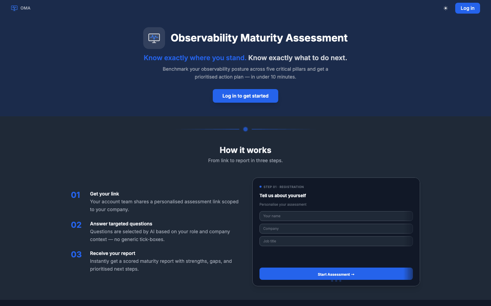
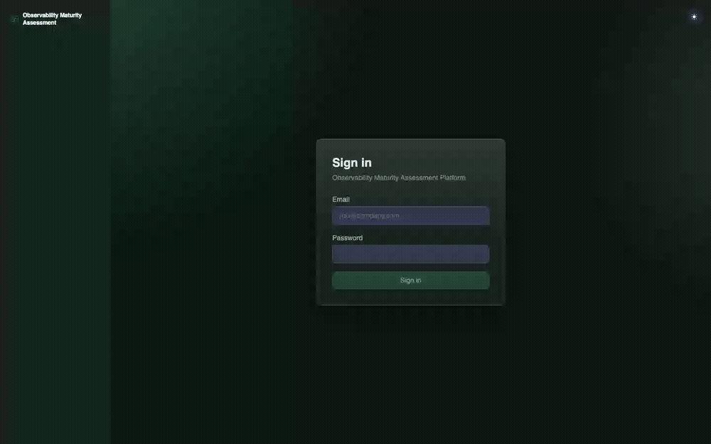
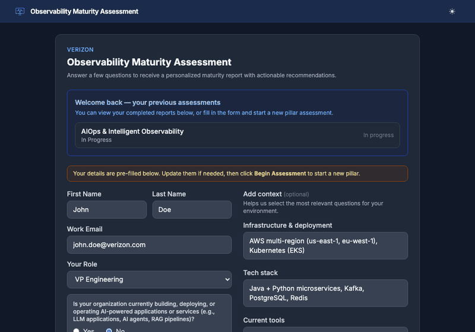
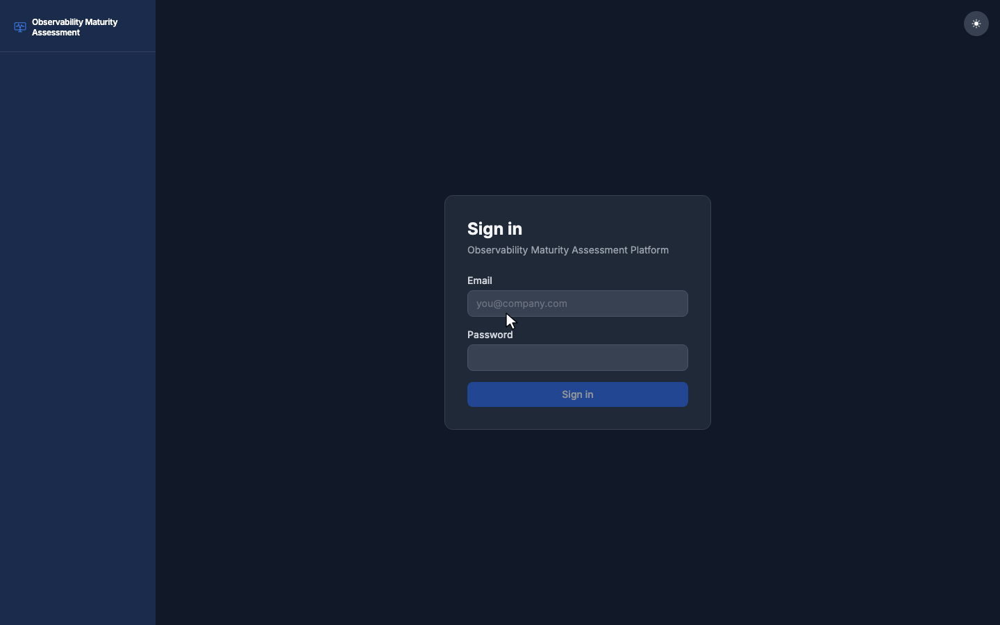
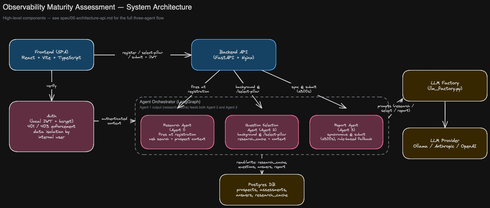

# Maturity Assessment Platform

A sales lead qualification tool that assesses prospect maturity through structured questions and answers. Prospects complete a pillar-based assessment, and a multi-agent LLM system generates a personalized maturity report. Sales teams use the report and raw answers to run more informed conversations.

---

## Table of Contents

- [Overview](#overview)
- [User Journeys](#user-journeys)
- [Architecture](#architecture)
- [Tech Stack](#tech-stack)
- [Getting Started](#getting-started)
- [Environment Variables](#environment-variables)
- [LLM Configuration](#llm-configuration)
- [User Roles](#user-roles)
- [Assessment Pillars](#assessment-pillars)
- [Multi-Agent System](#multi-agent-system)
- [Project Structure](#project-structure)
- [Running Tests](#running-tests)

---

## Overview

The platform supports three user roles — Prospects, Internal Users, and Admins — and walks a prospect through a five-pillar observability maturity assessment. After completing the assessment, a multi-agent LLM pipeline generates a structured report with an executive summary, strengths, gaps, and next steps.

**Key flows:**

1. Internal user creates a Prospect record under an Account, generating a unique short URL.
2. Prospect follows the link, registers, and reviews an AI-generated research summary.
3. Prospect selects a pillar and answers a personalised set of questions.
4. The LLM pipeline scores answers and generates a full maturity report.
5. Internal users review the report and raw answers to inform sales conversations.

---

## User Journeys

1. **Internal user logs in and tours the dashboard**

   

2. **Create an Account** — An internal user logs in and creates an Account for the target company (company name + website).

   

3. **Create a Prospect** — Under that Account, the internal user creates a Prospect (name/email), generating a unique short URL to send them.

   

4. **Prospect takes the survey** — The prospect opens the link, registers, reviews their research summary, picks a pillar, and answers the questions.

   

5. **View the maturity report** — Internal user (or the prospect) reviews the generated report across its tabs — Report, Questions & Answers, Research Summary, and Registration Context.

   

---

## Architecture

```
Browser
  └─► Nginx (port 8080)
        ├─► /api  →  FastAPI backend  →  PostgreSQL
        └─► /     →  React (Vite) frontend
```

All services run via Docker Compose. The backend uses LangGraph to orchestrate the multi-agent pipeline. LLM calls are routed through a single factory (`llm_factory.py`) that supports Ollama, Anthropic, and OpenAI interchangeably.



Editable source: [`docs/diagrams/system-architecture.excalidraw`](docs/diagrams/system-architecture.excalidraw) (open at [excalidraw.com](https://excalidraw.com) via File → Open).

---

## Tech Stack

| Layer | Technology |
|---|---|
| Frontend | React 18, TypeScript, Vite, Tailwind CSS |
| Backend | Python 3.12, FastAPI, SQLAlchemy (async), Alembic |
| Database | PostgreSQL 16 |
| AI / Agents | LangChain, LangGraph, supports Ollama / Anthropic / OpenAI |
| Auth | JWT (access + refresh tokens), bcrypt passwords |
| Proxy | Nginx |
| Containerisation | Docker Compose |

---

## Getting Started

**Prerequisites:** Docker, Docker Compose, and (optionally) the `gh` CLI.

```bash
# 1. Clone and configure environment
cp .env.example .env
# Edit .env — set JWT_SECRET_KEY, ADMIN_PASSWORD, and LLM credentials

# 2. Start all services
docker compose up

# 3. Verify the stack is healthy
curl http://localhost:8080/api/health
# Expected: {"status": "ok"}
```

The app is available at **http://localhost:8080**.

On first startup the backend seeds the database with pillars, questions, and the admin user defined in `.env`.

---

## Environment Variables

Copy `.env.example` to `.env` and fill in the values below.

| Variable | Required | Description |
|---|---|---|
| `POSTGRES_USER` / `POSTGRES_PASSWORD` / `POSTGRES_DB` | Yes | PostgreSQL credentials |
| `DATABASE_URL` | Yes | asyncpg connection string |
| `JWT_SECRET_KEY` | Yes | Min 32-char random string — change before deploy |
| `ADMIN_EMAIL` / `ADMIN_PASSWORD` / `ADMIN_NAME` | Yes | Seeded admin user |
| `LLM_PROVIDER` | Yes | `ollama` \| `anthropic` \| `openai` — applies to all agents |
| `OLLAMA_BASE_URL` / `OLLAMA_MODEL` | Ollama only | `.env.example` ships `http://host.docker.internal:11434` / `llama3.1:8b`; if `OLLAMA_MODEL` is unset entirely, code falls back to `llama3.2` |
| `ANTHROPIC_API_KEY` / `ANTHROPIC_MODEL` | Anthropic only | Model defaults to `claude-sonnet-4-6` |
| `OPENAI_API_KEY` / `OPENAI_MODEL` | OpenAI only | Model defaults to `gpt-4o` |
| `RESEARCH_AGENT_MODEL` | No | Per-agent model override; falls back to provider default if unset |
| `QUESTION_SELECTION_AGENT_MODEL` | No | Per-agent model override; falls back to provider default if unset |
| `REPORT_AGENT_MODEL` | No | Per-agent model override; falls back to provider default if unset |
| `BASE_URL` / `CORS_ORIGINS` | Yes | App URL and allowed origins |

---

## LLM Configuration

Switch providers by changing `LLM_PROVIDER` in `.env` and restarting — no code changes required. All provider logic lives in `backend/app/core/llm_factory.py`.

```bash
# Switch to Anthropic
LLM_PROVIDER=anthropic
ANTHROPIC_API_KEY=sk-ant-...

# Switch to OpenAI
LLM_PROVIDER=openai
OPENAI_API_KEY=sk-...

docker compose restart backend
```

Each agent has its own model override variable. If unset, the agent falls back to the provider default (`OLLAMA_MODEL`, `ANTHROPIC_MODEL`, or `OPENAI_MODEL`). A warning is logged at startup when an override is not set.

```bash
# Use a larger model for report generation only
REPORT_AGENT_MODEL=claude-opus-4-8

# Use a faster model for question selection
QUESTION_SELECTION_AGENT_MODEL=claude-haiku-4-5-20251001
```

---

## User Roles

| Role | Access |
|---|---|
| **Admin** | Full CRUD on pillars, questions, internal users, and system settings |
| **Internal User** | Create/view Accounts and Prospects; view reports for their own Prospects |
| **Prospect** | Complete assessment via unique short URL; view and download their report |

---

## Assessment Pillars

| ID | Pillar | Notes |
|---|---|---|
| P1 | Full-Stack Observability | Always active |
| P2 | AIOps & Intelligent Observability | Always active |
| P3 | AI Application Observability | Gated — hidden when gate answered No |
| P4 | ML & Foundation Model Operations | Gated + seeded inactive; activates via admin panel |
| P5 | Security & DevSecOps | Always active |

Each pillar has a configurable question count (default 12, bounds 12–25, admin-editable).

---

## Multi-Agent System

Three agents orchestrated by LangGraph:

| Agent | Trigger | Purpose |
|---|---|---|
| **Agent 1 — Research** | Prospect registration (non-blocking) | Web research + prospect context → research summary shown before assessment |
| **Agent 2 — Question Selection** | Pillar selection (background) | Selects the right questions from the bank based on research profile and prospect context; falls back to rule-based if LLM fails |
| **Agent 3 — Report** | Assessment submission | Scores answers, generates executive summary, strengths, gaps, and next steps |

See [`docs/diagrams/agent-architecture.excalidraw`](docs/diagrams/agent-architecture.excalidraw) for the full agent interaction diagram — triggers, the LangGraph orchestrator's internal nodes, and how all three agents route through `llm_factory.py`. Open it at [excalidraw.com](https://excalidraw.com) (File → Open).

---

## Project Structure

```
maturity-assessment/
├── backend/
│   ├── app/
│   │   ├── agents/          # LangGraph agents (research, question selection, report, orchestrator)
│   │   ├── core/            # llm_factory, auth, config
│   │   ├── models/          # SQLAlchemy ORM models
│   │   ├── routers/         # FastAPI route handlers
│   │   ├── schemas/         # Pydantic request/response schemas
│   │   ├── seed/            # Pillar, question, and admin seed data
│   │   └── services/        # Business logic layer
│   ├── alembic/             # Database migrations
│   └── tests/               # pytest test suite
├── frontend/
│   └── src/
│       ├── api/             # All API calls (no inline fetch in components)
│       ├── components/      # Shared UI components
│       ├── contexts/        # SessionContext (form state persistence)
│       ├── pages/
│       │   ├── admin/       # Admin CRUD pages
│       │   ├── internal/    # Internal user dashboard and report views
│       │   └── prospect/    # Prospect assessment flow
│       ├── types/           # TypeScript interfaces
│       └── utils/           # PDF download, report color helpers
├── nginx/                   # Nginx reverse proxy config
├── spec/                    # Product specs (read-only reference)
├── docker-compose.yml
└── .env.example
```

---

## Running Tests

```bash
# From the repo root — runs the backend test suite inside the container
docker compose exec backend pytest

# Or locally with a virtual environment
cd backend
pip install -r requirements-dev.txt
pytest
```

Tests cover API route status codes, auth enforcement, scoring logic, agent prompt construction, and fallback behaviour. All tests mock the database and LLM calls at the boundary — none require a live Postgres instance or network access.
