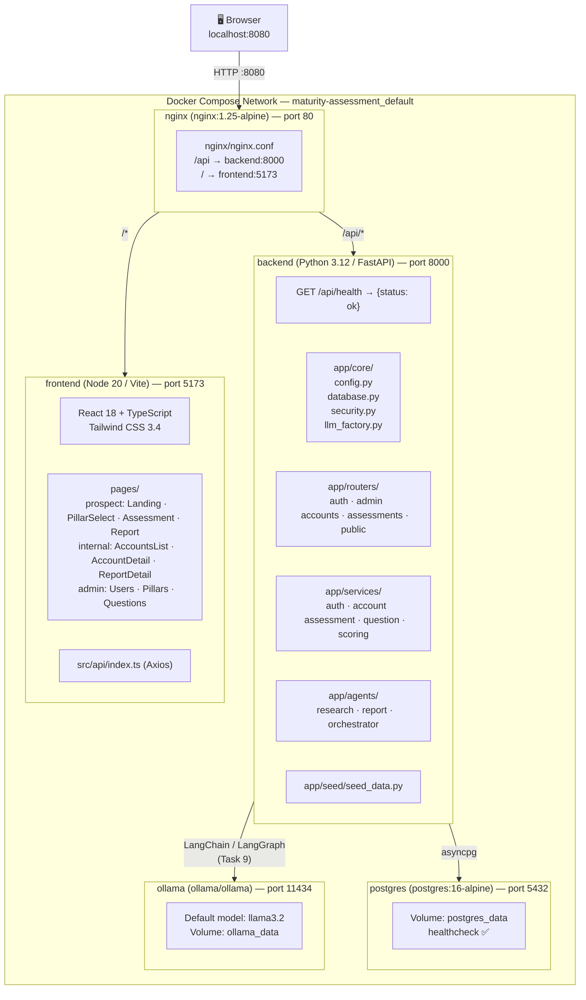

# Task 1: Project Scaffolding — Architecture Diagram



## Services Summary

| Service | Image | Internal Port | Host Port | Purpose |
|---------|-------|--------------|-----------|---------|
| nginx | nginx:1.25-alpine | 80 | **8080** | Reverse proxy — routes traffic to backend and frontend |
| backend | python:3.12-slim | 8000 | — | FastAPI app, business logic, LLM orchestration |
| frontend | node:20-alpine | 5173 | — | React 18 + Vite dev server |
| postgres | postgres:16-alpine | 5432 | — | Primary database |
| ollama | ollama/ollama | 11434 | 11434 | Local LLM server (llama3.2) |

## Notes

- Port **8080** is used instead of 80 because port 80 is held by an SSH tunnel on the host machine.
- Backend and frontend volumes are bind-mounted (`./backend:/app`, `./frontend:/app`) so code changes hot-reload without rebuilding.
- The `llm_factory.py` abstraction allows switching between Ollama, Anthropic, and OpenAI via a single `LLM_PROVIDER` env var — no code changes needed.
- LLM agent wiring (Task 9) is scaffolded but not yet implemented.
```
